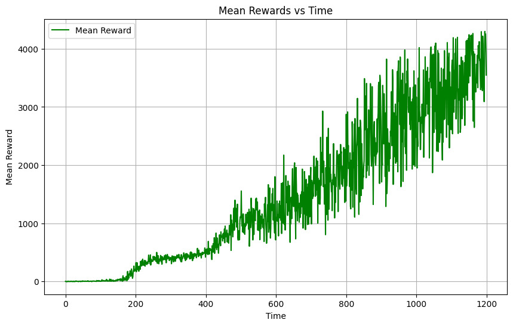
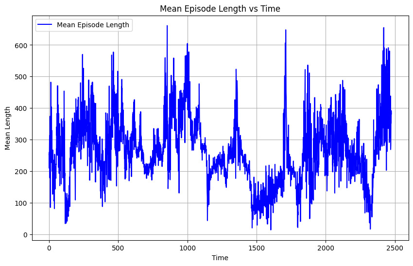

# Reinforcement Learning with Walker2D  

This repository contains code and resources for training, evaluating, and visualizing reinforcement learning (RL) algorithms on the **Walker2D** environment. The project supports two popular algorithms: **PPO** (Proximal Policy Optimization) and **A2C** (Advantage Actor-Critic).

<div style="display: flex; justify-content: space-around;">
  
  
</div>

## Usage  

### Simulating a Model  
To simulate a trained RL model in the Walker2D environment:  
1. Ensure you have the required dependencies installed.  
2. Run the `simulate.py` script:  

```bash

python3 simulate.py --env_name Walker2d-v5 --model_name best_model_ppo.zip  --algo PPO

```

---

## Repository Structure  

### Files  
- **`simulate.py`**  
  A script to simulate the trained model using the provided algorithm and checkpoints. The script accepts command-line arguments to specify the environment, algorithm, and model checkpoint path.

### Folders  
- **`stats_a2c/`**  
  Contains code and resources for visualizing training metrics (e.g., rewards and episode lengths) generated from the A2C algorithm's checkpoints.

- **`stats_ppo/`**  
  Contains code and resources for visualizing training metrics (e.g., rewards and episode lengths) generated from the PPO algorithm's checkpoints.

---


